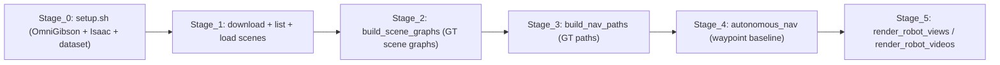

# BEHAVIOR-1K


**BEHAVIOR-1K** is a comprehensive simulation benchmark for testing embodied AI agents on 1,000 everyday household activities. This monolithic repository provides everything needed to train and evaluate agents on human-centered tasks like cleaning, cooking, and organizing — activities selected from real human time-use surveys and preference studies.

This repository layout pairs upstream **BEHAVIOR-1K / OmniGibson / Isaac Sim** (under `BEHAVIOR-1K/`) with a **D1 replication pipeline** at the repository root: curated multi-room and multi-floor indoor scenes, **ground-truth structural scene graphs**, **ground-truth navigation paths**, a **waypoint-following navigation baseline** on the simulator traversability map (A\*, pure pursuit, LiDAR blending, ground-truth pose), and optional **first-person gallery renders**. That pipeline matches the D1 scope in the project proposal *Scene-Graph-Based Navigation for Search in Indoor HADR Environments* (base undamaged scenes and annotations first; dynamic hazard-conditioned variants are future work).

***Check out our [main website](https://behavior.stanford.edu/) for more details.*** The official stack install is also documented in the [Installation Guide](https://behavior.stanford.edu/getting_started/installation.html).

---

## Pipeline overview

Run commands from the **repository root** (the directory that contains `BEHAVIOR-1K/` and `selected_scenes.txt`), unless noted. Stages 1–3 are CPU-only and can run on macOS without a GPU. Stages 4–5 require an NVIDIA GPU with the OmniGibson + Isaac Sim stack from Stage 0.



---

## Prerequisites

| Item | Notes |
| --- | --- |
| **GPU** | NVIDIA GPU with a recent driver (e.g. g5.xlarge with A10G, 24 GB, has been used). |
| **OS** | **Ubuntu 22.04** for Isaac Sim + OmniGibson. |
| **Python env** | **Conda**; the provided installer creates env `behavior` with **Python 3.10** (see [BEHAVIOR-1K/setup.sh](BEHAVIOR-1K/setup.sh)). |
| **Disk** | Tens of GB for `datasets/` and caches (official guide gives current sizes). |
| **Network** | Hugging Face access for the BEHAVIOR-1K asset download used by the pipeline scripts. |

---

## Stage 0: Install BEHAVIOR-1K, OmniGibson, and Isaac Sim

1. Clone this **full** repository (not only the `BEHAVIOR-1K` subfolder) so the pipeline scripts and [selected_scenes.txt](selected_scenes.txt) sit next to `BEHAVIOR-1K/`.

2. From the **repository root**:

   ```bash
   cd BEHAVIOR-1K
   chmod +x setup.sh
   ./setup.sh --new-env --omnigibson --bddl --dataset \
     --accept-conda-tos --accept-nvidia-eula --accept-dataset-tos
   ```

   `setup.sh` creates conda env `behavior`, installs **BDDL**, **PyTorch** (CUDA), **OmniGibson** in editable form, **Isaac Sim** via pip, and downloads **BEHAVIOR-1K** robot assets, scene data, and 2025 challenge task instances. See the script’s `--help` for optional flags (e.g. `--cuda-version`).

3. Activate and set data path (adjust `REPO` to your clone path):

   ```bash
   conda activate behavior
   export OMNIGIBSON_DATA_PATH="$REPO/BEHAVIOR-1K/datasets"
   ```

If you hit environment issues, use the [Installation Guide](https://behavior.stanford.edu/getting_started/installation.html) and ensure no stale `EXP_PATH` / `CARB_APP_PATH` / `ISAAC_PATH` are set from an old install.

---

## Stage 1: Curate and validate base scenes

**Goal:** A diverse set of **undamaged** BEHAVIOR-1K scenes (single-floor multi-room and multi-floor), aligned with the D1 benchmark-foundation focus (see proposal §5.2).

1. **Download** JSON, layout, and related assets for the scenes listed in [selected_scenes.txt](selected_scenes.txt) (10 curated names, including `Rs_int`, `Benevolence_1_int`, `Benevolence_2_int`, and multi-floor `house_double_floor_*`).

   From **repository root**:

   ```bash
   python3 download_scene_assets.py --accept-license
   ```

   - Default data root: `BEHAVIOR-1K/datasets` (overridable with `--data-dir`).
   - Use `--skip-key` only if you are **not** running the full simulator and only need JSON/layout for offline graph tools.

2. **Regenerate or verify** the scene list from what is on disk:

   ```bash
   python3 list_and_select_scenes.py --output selected_scenes.txt
   ```

3. **Smoke-test loading** every scene in OmniGibson (GPU):

   ```bash
   python3 load_scenes.py --accept-license
   ```

   - Uses [selected_scenes.txt](selected_scenes.txt) by default (`--scenes-file` to override).
   - On an EC2 instance with NICE DCV, you can use [cycle_scenes.sh](cycle_scenes.sh) instead (wrapper around [cycle_scenes.py](cycle_scenes.py), fixed list of 10 scenes, includes `--accept-license`).

---

## Stage 2: Build ground-truth scene graphs

**Goal:** For each scene, an **entity-centric structural graph** (rooms, doors, connectivity) derived from scene JSON and layout maps, as in the proposal’s Figure 4(B).

From **repository root**:

```bash
python3 build_scene_graphs.py --scene-list selected_scenes.txt --output-dir output/scene_graphs
```

- Resolves `--scenes-root` from `OMNIGIBSON_DATA_PATH` or `BEHAVIOR-1K/datasets/behavior-1k-assets/scenes`.
- Typical outputs per scene under `output/scene_graphs/<SceneName>/`: `scene_graph.json`, `scene_graph.png`, `scene_graph_overlay_*.png`, `birds_eye_layout_*.png`. The builder also writes `output/scene_graphs/SCENE_GRAPHS_README.txt` at the output root the first time you run it.

**Optional:** After hand-editing a few `scene_graph.json` files for complex multi-floor scenes, re-rasterize overlays:

```bash
python3 regen_three_scenes.py
```

---

## Stage 3: Build ground-truth navigation paths

**Goal:** **Low-level paths** (waypoint polylines) between room pairs on the traversability map, for supervision and for downstream planning/visualization, as in proposal §4.2 / Figure 4(D).

From **repository root** (defaults read [selected_scenes.txt](selected_scenes.txt) and write next to each graph):

```bash
python3 build_nav_paths.py --output-root output/scene_graphs --waypoint-spacing 0.10
```

- Default scenes root: `BEHAVIOR-1K/datasets/behavior-1k-assets/scenes`.
- Outputs per scene: `nav_paths.json`, `nav_paths_floor_*.png` under `output/scene_graphs/<SceneName>/`.

---

## Stage 4: Run the waypoint-execution navigation baseline

**Goal:** **High-level task goals** (e.g. ordered waypoints) plus **low-level** A\* on the traversability map, **pure pursuit** along the polyline, and **2D LiDAR**-based reactive behavior, using **ground-truth pose** from the simulator. This is the D1 “planner + waypoint follower on GT map/graph” baseline (proposal §4.2, Figure 3–4), not the full online scene-graph search system.

From **repository root**, with `conda activate behavior` and `OMNIGIBSON_DATA_PATH` set:

```bash
# Part B: ~180 s segment in Rs_int (use --short for ~10 s smoke test)
python autonomous_nav_60s.py --record --no-teleop-camera

# Benevolence_1_int: multi-goal tour ( --once ends after the last goal)
python autonomous_nav_benevolence1.py --record --no-teleop-camera --once

# Benevolence_2_int: seven-waypoint tour (uses nav_paths.json for passage hints)
python autonomous_nav_benevolence2.py --record --no-teleop-camera --once
```

Default FPV output paths: `output/autonomous_nav_fpv.mp4`, `output/autonomous_nav_benevolence1_fpv.mp4`, `output/autonomous_nav_benevolence2_fpv.mp4`. Each run can also emit diagnostics next to the video (e.g. `*_nav.csv`, `*_events.log`, `*_summary.json`).

**Static path figures (optional):** planned (and optional executed) paths on the traversability map:

```bash
python3 plot_marked_waypoints_path.py
python3 plot_marked_waypoints_path_benevolence2.py
```

Defaults write `output/benevolence1_marked_path.png` and `output/benevolence2_marked_path.png` (see `--pdf`, `--nav-csv`, `--out` in each script).

---

## Stage 5: Gallery renders (RGB stills and FPV videos)

**Goal:** Qualitative “gallery” assets comparable to a proposal figure sheet: robot **first-person** RGB stills and short **FPV** clips per scene, driven in part by `nav_paths.json`.

On a **GPU** machine with the same conda env, from **repository root**:

```bash
./render_robot_views.sh
./render_robot_videos.sh
```

These wrap [render_robot_views.py](render_robot_views.py) and [render_robot_videos.py](render_robot_videos.py) with `--accept-license` and default output under `output2/robot_views/` and `output2/robot_videos/`. Pass `--headless` on a headless host if your stack supports it. Override scenes with e.g. `./render_robot_videos.sh --scenes Rs_int,Benevolence_1_int`.

---

## Stage 6 (optional): EC2, DCV, sync, and pull

For a typical cloud workflow, mirror the repo to the instance, use **NICE DCV** for interactive Kit, and pull artifacts back to a laptop. Helper scripts (run from the machine that matches their comments — Mac vs EC2) include:

- [sync_to_ec2.sh](sync_to_ec2.sh) — `rsync` repository to `~/OmniGibson_TakeHomeTest` (optional `--skip-behavior` if `BEHAVIOR-1K` already exists on the instance).
- [dcv_tunnel.sh](dcv_tunnel.sh) — SSH local forward to DCV (e.g. open `https://localhost:8443` on the client).
- [run_partB_dcv.sh](run_partB_dcv.sh) — launches [autonomous_nav_60s.py](autonomous_nav_60s.py) with EC2-oriented env.
- [run_benevolence_ec2_and_pull.sh](run_benevolence_ec2_and_pull.sh) / [run_benevolence2_ec2_and_pull.sh](run_benevolence2_ec2_and_pull.sh) — remote run + pull logs/video.
- [sync_and_render_robot_videos_ec2.sh](sync_and_render_robot_videos_ec2.sh) / [monitor_pull_robot_videos.sh](monitor_pull_robot_videos.sh) / [pull_robot_videos.sh](pull_robot_videos.sh) — batch FPV render and sync.
- [transcode_robot_videos_h264.sh](transcode_robot_videos_h264.sh) — after pull on **macOS**, re-encode to H.264 for QuickTime; default directory `output2/robot_videos`.

If the simulator loads stale USD or behaves oddly after asset edits, clear Kit caches (global cache under `og-appdata/global/cache/` and scene JSON USDC artifacts under `og_dataset/scenes/<Scene>/json/*.usd`).

---

## Output layout (quick reference)

- `output/scene_graphs/<SceneName>/` — `scene_graph.json`, `nav_paths.json`, overlays.
- `output/autonomous_nav_*.mp4` and `output/autonomous_nav_*_nav.csv` (when recorded) — Part B and Benevolence baselines.
- `output/benevolence1_marked_path.png`, `output/benevolence2_marked_path.png` — static path figures.
- `output2/robot_views/<SceneName>/` — per-scene robot RGB/depth stills.
- `output2/robot_videos/<SceneName>/` — e.g. `fpv_<SceneName>.mp4` and `fpv_*_nav.csv`.

---

## Troubleshooting (short)

- **Missing assets / license** — Re-run [download_scene_assets.py](download_scene_assets.py) with `--accept-license`, or use Stage 0 `setup.sh --dataset` and accept dataset terms. Use `load_scenes.py --accept-license` for non-interactive download during smoke tests.
- **Stale or corrupted sim state** — Remove Kit / appdata caches (`og-appdata/global/cache/*`) and scene USD caches (`og_dataset/scenes/<Scene>/json/*.usd`).
- **DCV “localhost:8443” unreachable** — Ensure [dcv_tunnel.sh](dcv_tunnel.sh) (or an equivalent `ssh -L`) is running.
- **Killing the wrong process over SSH** — Avoid `pkill -f` patterns that match your shell; prefer a process-specific pattern like `pkill -f '[a]utonomous_nav_60s.py'`.

---

## Citation

```bibtex
@article{li2024behavior1k,
    title   = {BEHAVIOR-1K: A Human-Centered, Embodied AI Benchmark with 1,000 Everyday Activities and Realistic Simulation},
    author  = {Chengshu Li and Ruohan Zhang and Josiah Wong and Cem Gokmen and Sanjana Srivastava and Roberto Martín-Martín and Chen Wang and Gabrael Levine and Wensi Ai and Benjamin Martinez and Hang Yin and Michael Lingelbach and Minjune Hwang and Ayano Hiranaka and Sujay Garlanka and Arman Aydin and Sharon Lee and Jiankai Sun and Mona Anvari and Manasi Sharma and Dhruva Bansal and Samuel Hunter and Kyu-Young Kim and Alan Lou and Caleb R Matthews and Ivan Villa-Renteria and Jerry Huayang Tang and Claire Tang and Fei Xia and Yunzhu Li and Silvio Savarese and Hyowon Gweon and C. Karen Liu and Jiajun Wu and Li Fei-Fei},
    journal = {arXiv preprint arXiv:2403.09227},
    year    = {2024}
}
```
